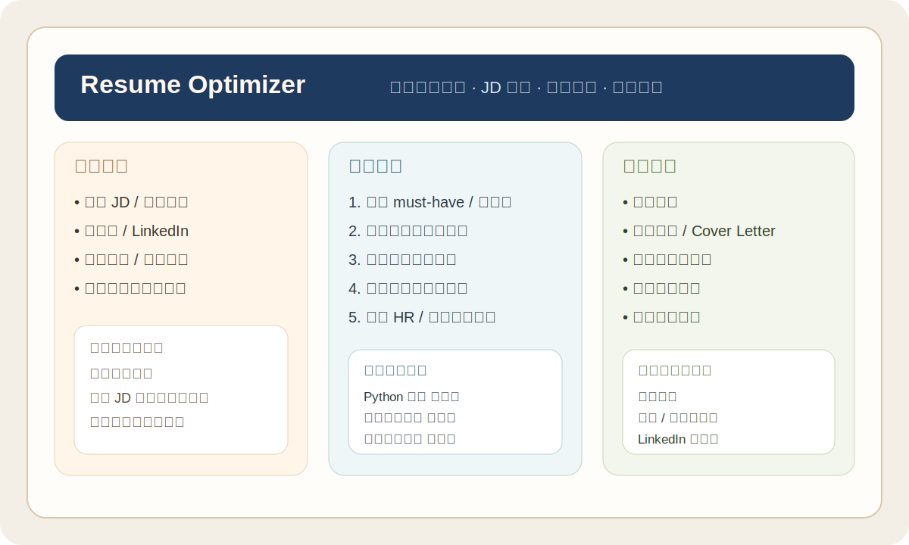

# Resume Optimizer

Resume Optimizer 是一个面向 AI 助手的简历优化与求职材料定制 skill。

它不是“套模板写一份简历”，而是先读懂岗位 JD 或活动要求，再结合候选人的原始材料，输出更贴合场景的简历、报名文案、模拟评审与修改建议。



## 中文介绍

### 它解决什么问题

很多简历工具只能把已有内容排版得更像简历，但不会告诉你：

- 这份 JD 真正在筛什么人
- 你的经历里哪些点最该放大
- 哪些要求你没有正面回应
- 面试官为什么会在 30 秒内划走

`resume-optimizer` 的目标，是把“写简历”变成一套更接近真实求职决策的工作流。

### 适用场景

- 针对具体岗位 JD 定制简历
- 根据活动、比赛、黑客松要求准备报名材料
- 生成匹配分析、模拟招聘方评价、面试准备清单
- 输出 Markdown 简历，并支持后续导出 PDF、Word、HTML

### 核心能力

1. 解析 JD / 活动要求，提取 must-have、加分项和关键词
2. 解析候选人材料，抽取经历、项目、技能和量化成果
3. 输出匹配分析，识别信息缺口并引导补充
4. 生成结构化 Markdown 简历或报名材料
5. 做 self-awareness 分析与模拟招聘方 / 评委评价
6. 给出可直接落地的改写建议

### 触发方式

当用户出现这些意图时建议启用：

- “帮我投这个岗位”
- “根据这个 JD 优化我的简历”
- “帮我写简历”
- “帮我准备黑客松报名材料”
- “我要参加这个比赛，帮我整理报名材料”

### 目录结构

```text
resume-optimizer/
├── SKILL.md
├── promotion.md
├── CHANGELOG.md
├── CONTRIBUTING.md
├── LICENSE
├── assets/
│   └── resume-optimizer-preview.svg
├── evals/
│   └── evals.json
└── examples/
    └── example-prompts.md
```

### 安装

把整个目录放到你的 skills 目录中即可，例如：

```bash
cp -R resume-optimizer ~/.config/opencode/skills/resume-optimizer
```

如果你的宿主环境使用别的 skills 目录，请按对应规范调整路径。

### 使用方式

把岗位 JD、活动要求和个人材料一起交给支持 skills 的 AI 助手。材料可以是不完整的旧简历、LinkedIn 资料、自述文字、项目经历或截图。

你可以参考 [examples/example-prompts.md](./examples/example-prompts.md) 中的示例输入。

## English

### What It Does

`resume-optimizer` is an AI skill for resume optimization and application material tailoring.

Instead of filling a generic template, it first analyzes the job description or event brief, then maps the candidate's background against that target and produces:

- tailored resumes
- match analysis
- hiring-manager-style feedback
- improvement suggestions
- optional supporting materials

### Good Fit For

- tailoring a resume to a specific job description
- preparing hackathon or competition applications
- converting messy raw background notes into structured materials
- generating interview prep prompts based on gaps and strengths

### Output Style

The skill is designed to prioritize:

- honesty over fabrication
- specificity over generic wording
- ATS-friendly language without keyword stuffing
- user control at every important decision point

### Compatibility

When `SKILL.md` mentions question-asking tools, it refers to whatever user follow-up mechanism your host environment provides. If your setup has no dedicated tool, normal conversational follow-up works as a fallback.

## Open Source Notes

- License: [MIT](./LICENSE)
- Change log: [CHANGELOG.md](./CHANGELOG.md)
- Contribution guide: [CONTRIBUTING.md](./CONTRIBUTING.md)
- Promotion copy: [promotion.md](./promotion.md)

## Roadmap

- add more real-world resume examples
- provide multiple output styles for different markets
- expand eval coverage for bilingual and cross-border applications
